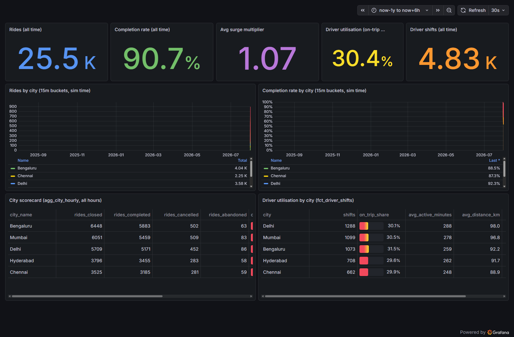
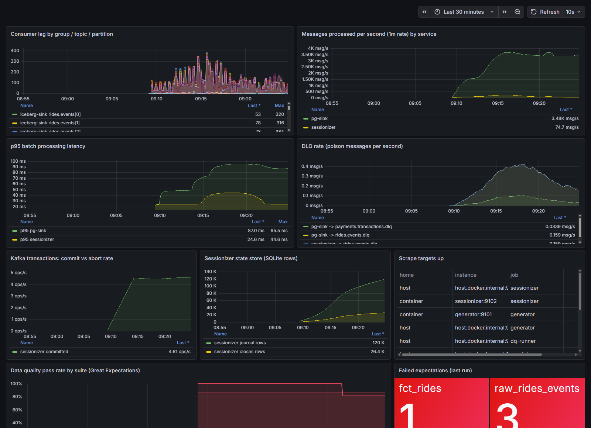
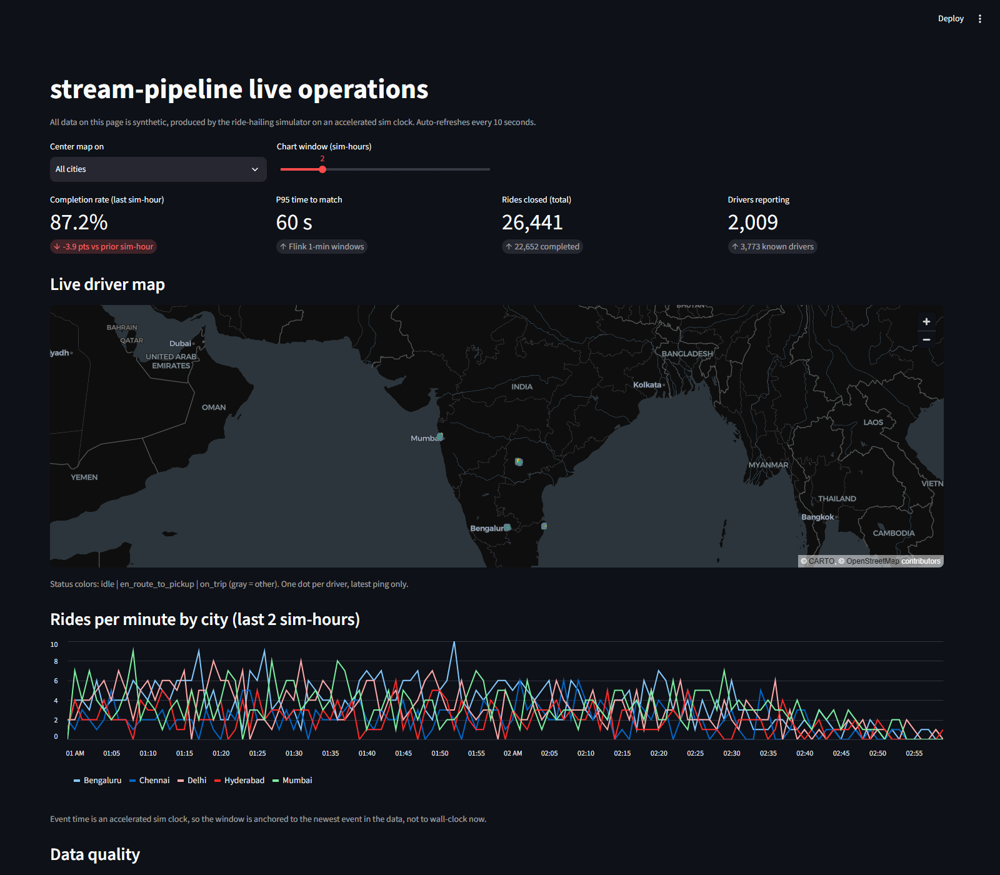
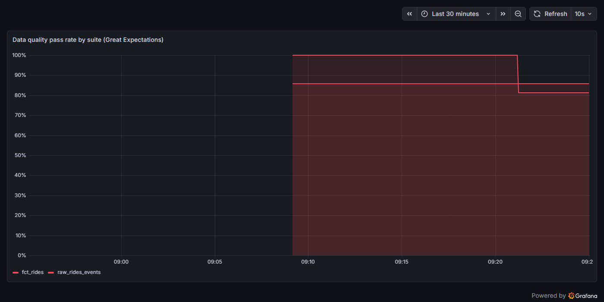
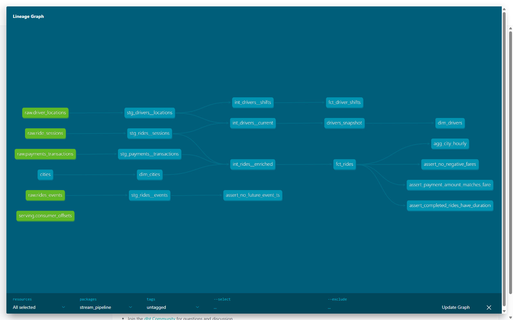
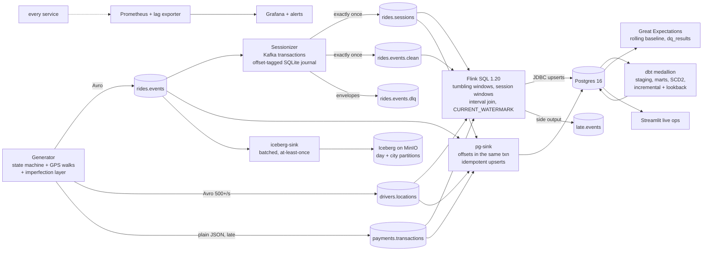

# stream-pipeline

[](https://github.com/akriti-adarsh/Stream-Pipeline/actions/workflows/ci.yml)

A real-time data platform built end to end and proven under fire: synthetic ride-hailing
producers stream into Redpanda, a transactional stream processor with exactly-once semantics
sessionizes rides, Flink SQL runs the windowed and joined paths, and results land in a Postgres
serving layer and an Apache Iceberg lakehouse on MinIO. dbt models the warehouse, Great
Expectations gates quality, Prometheus and Grafana watch everything, and a live Streamlit
dashboard sits on top.

One command boots all of it, no cloud account, and the first events hit the broker in seconds:

```bash
docker compose --profile full up -d --wait
```

## The headline claims, each one tested

| Claim | How it is proven | Where |
|---|---|---|
| Exactly-once from Kafka to Postgres | A chaos harness SIGKILLs the processors mid-batch at four different points (sink early, sessionizer mid-transaction, both at once, and with duplicate injection ON), restarts them, and asserts Postgres holds EXACTLY the broker-acked event set: no loss, no duplicates, byte-for-byte id equality | [tests/integration/test_exactly_once.py](tests/integration/test_exactly_once.py) |
| The whole platform cold-starts and flows | The e2e harness wipes volumes, boots the full profile, and asserts real row counts across all six layers (broker, Postgres raw, Flink sinks, Iceberg, dbt marts, DQ gates); latest run green in 227 seconds | [scripts/e2e.sh](scripts/e2e.sh) |
| Dirty data is handled, not hidden | The generator injects duplicates, out-of-order events, late events, corrupt payloads, and nulls at documented rates; poison lands in a DLQ with replayable envelopes, and the corrupt-to-DLQ-to-repair-to-replay loop is a passing integration test | [tests/integration/test_dlq_replay.py](tests/integration/test_dlq_replay.py) |
| Schema evolution without redeployment | Mid-stream the producer switches to v2 (adds promo_code); consumers keep running on the v2 reader schema, and the Iceberg table evolves its schema in place while old files stay readable | [tests/integration/test_schema_evolution.py](tests/integration/test_schema_evolution.py) |
| Late data is surfaced, not dropped | An event injected 10 minutes behind the watermark lands in the late.events side output AND still reaches the incremental fact through dbt's lookback window | [tests/integration/test_late_data.py](tests/integration/test_late_data.py) |
| The warehouse holds under test | dbt build runs 121 checks green: every model, an SCD Type 2 snapshot, schema tests on every column, and four singular business-invariant tests | [tests/integration/test_dbt_build.py](tests/integration/test_dbt_build.py) |

## Screenshots

Live business dashboard (Grafana, SQL panels over the dbt marts):



Pipeline health (Prometheus metrics: consumer lag, throughput, transaction commits, DLQ rate):



Streamlit ops view (live driver map, rides per minute, DQ strip):



Quality gates failing loudly after deliberately injected bad data (the point of gates):



dbt lineage (committed static docs under [docs/dbt/](docs/dbt/index.html)):



## Why this project exists

Most streaming demos cheat in three ways: the data is too clean, "exactly-once" is claimed but
never killed mid-transaction, and the failure paths (late data, poison messages, schema drift)
are simply never generated. This platform does the opposite on purpose:

- The generator produces **deliberately imperfect data** with a documented, configurable rate
  for every imperfection, and the same seed reproduces the same stream, warts included.
- Exactly-once is **demonstrated by killing processes**, not by quoting documentation. The kill
  harness compares Postgres against the ledger of broker-ACKED event ids, which is the only
  honest definition of "what was produced".
- Every operational surface a real platform needs exists and runs: dead-letter envelopes with
  a replay tool, consumer-lag alerting, quality gates that can fail the pipeline, a runbook
  with real diagnostic commands, and dashboards fed by real metrics.

## Architecture



### Four delivery contracts, each labelled

"Exactly-once" is a property of a path, not a platform, so each path states its contract:

| Path | Contract | Mechanism |
|---|---|---|
| rides.events to rides.sessions and rides.events.clean | Exactly-once | Kafka transactions: outputs and consumed offsets commit atomically; stable transactional.id fences zombies; the local state store is offset-tagged and rolled back on recovery (the two-store gap, closed structurally) |
| Kafka to Postgres | Effectively exactly-once | The offsets row commits in the SAME Postgres transaction as the data; on startup the consumer seeks stored offset + 1 and ignores broker offsets; upserts are idempotent on natural keys. The standard pattern when the sink cannot join a Kafka transaction |
| Kafka to Iceberg | At-least-once, documented | Offsets commit after each append; replays are possible, visible in the snapshot log, and deduplicable on event_id. The exactly-once budget was spent where duplicates would corrupt marts |
| Flink to Postgres | At-least-once + idempotent | Primary keys on every windowed sink table turn replays into overwrites |

The interview-grade detail: the sessionizer writes its SQLite journal BEFORE the Kafka
transaction commits, which opens a two-store gap. Every journal row is tagged with the
(partition, offset) that caused it; on startup, Kafka's transactionally-committed offsets
decide the resume point and every row tagged at or beyond it is deleted before a single byte
is consumed. A unit test dies exactly inside that gap and proves the recovery; the integration
matrix does it with real SIGKILLs. See [docs/adr/0002](docs/adr/0002-sqlite-journal-state-store.md).

### The poison firewall

Open-source Flink's avro-confluent format cannot skip an unparseable record, and this platform
guarantees unparseable records exist. Rather than sanitising the input (which would delete the
DLQ story) the sessionizer re-publishes every successfully-decoded event to
`rides.events.clean` INSIDE its transaction: declarative consumers get a schema-clean,
exactly-once mirror with identical event times (late and out-of-order included), while the raw
topic keeps its poison for the consumers built to handle it.
[docs/adr/0003](docs/adr/0003-clean-mirror-for-declarative-consumers.md) has the trade-offs.

## The data

Five simulated Indian metros; three source topics with real stream semantics:

| Topic | Format | Content |
|---|---|---|
| rides.events | Avro (registry) | Ride lifecycle: requested, matched, driver_arrived, started, completed, cancelled; driven through a state machine so an illegal transition is structurally impossible (property-tested across seeds) |
| drivers.locations | Avro (registry) | GPS pings from a fleet on smoothed random walks, status-conditional speeds, offline episodes; the fleet self-scales to ride demand (overflow drivers spawn when every driver is busy and rejoin the idle pool after), so ping volume grows from 600 msg/sec at boot to about 3,000 msg/sec at demand equilibrium |
| payments.transactions | Plain JSON, schema governed in the registry | One payment per completed ride, arriving 5 to 90 seconds late BY DESIGN so every join must handle it |

Rides follow a diurnal double-peak demand curve compressed by `--speed` (one real second is one
sim minute by default), surge follows demand, fares follow distance and time, and drivers are
genuinely assigned: the pings and the lifecycle events tell one coherent story.

### The imperfection layer

Every rate is a CLI flag; `--perfect` zeroes them all (the kill test uses that):

| Imperfection | Default rate | What it exercises |
|---|---|---|
| Duplicates (same event_id re-sent 1 to 10 s later) | 0.5% | Idempotent upserts, dedup keys |
| Out-of-order (emission held up to 30 s) | 2% | Watermarks, order-insensitive session folding |
| Late (held 30 s to 10 min, past any sane watermark) | 1% | late.events side output, dbt lookback |
| Malformed (corrupt wire bytes) | 0.2% | DLQ envelopes, replay tooling, the poison firewall |
| Null nullable fields | 1% | Schema honesty end to end |
| Bad data (valid schema, absurd values) | off; flag for demos | Great Expectations gates, the DQ failure panel |
| Schema evolution (`--evolve-after N`) | off; on in tests | v1 to v2 mid-stream with zero redeployments |

## Layer notes

**Flink SQL** (three pipelines, all RUNNING under the session cluster): 1-minute tumbling city
metrics; p50/p95 time-to-match via 5-second histogram buckets finished by a Postgres view
(Flink 1.20 has no percentile aggregate; the workaround is documented in the job header);
5-minute-gap SESSION windows for driver utilisation; a 15-minute interval join of sessions to
payments with a left-outer variant surfacing unpaid rides; and the late side output using
`CURRENT_WATERMARK()`. Jars are pinned and verified in [flink/VERSIONS.md](flink/VERSIONS.md).

**Iceberg lakehouse**: day + city partitioning, live schema evolution, snapshot time travel,
and per-partition transactional compaction (10 files to 1 per partition, row counts asserted
equal, pre-compaction snapshots still readable). Real command output in
[docs/lakehouse.md](docs/lakehouse.md).

**dbt** (medallion): typed staging views; an enriched intermediate join that keeps unpaid rides
visible; marts with an SCD Type 2 driver dimension via a dbt snapshot (status, tier, city
tracked with validity intervals); `fct_rides` incremental with a merge strategy and a
60-sim-minute event-time lookback whose reasoning is a comment in the model; an hourly city
rollup; 121 checks total including four singular business invariants.

**Quality gates**: two Great Expectations suites run as real pipeline steps. Results land in
queryable `serving.dq_results`, pass rates are Prometheus gauges, `--mode fail` exits nonzero
(CI-gateable), and the fct_rides row-count check uses a ROLLING baseline derived from its own
history: an append-only table that shrinks means data loss, and the floor is the highest count
ever observed.

**Observability**: every service exposes `sp_*` metrics (message throughput, per-batch latency
histograms, DLQ counts, transaction commits vs aborts, state-store size, sessions emitted, rows
written); a lag exporter derives `sp_consumer_lag` from broker offsets AND from the pg-sink's
Postgres-stored offsets (that group deliberately ignores broker commits); alert rules page on
sustained lag and on services down in every home. Dashboards are provisioned from committed
JSON.

## Quickstart

Requirements: Docker with about 10 to 12 GB available for the full profile (about 6 GB for
core), [uv](https://docs.astral.sh/uv/), GNU Make. No cloud account, no external services.

```bash
# The exactly-once heart: broker, registry, Postgres, MinIO, generator,
# sessionizer, pg-sink. Producing within seconds of healthy.
docker compose --profile core up -d --wait

# Everything: + Flink, Iceberg REST catalog, iceberg-sink, Prometheus,
# Grafana, DQ runner, lag exporter, Streamlit.
docker compose --profile full up -d --wait

make test          # ruff + mypy --strict + unit suite (80 percent coverage floor)
make kill-test     # the SIGKILL matrix (run against the CORE profile)
make e2e           # cold start, assert every layer, tear down
make dbt-build     # models + snapshot + all 121 checks
make dq-fail       # quality gates, nonzero exit on failure
```

| Surface | Host URL |
|---|---|
| Streamlit ops dashboard | http://localhost:8601 |
| Grafana (anonymous viewer) | http://localhost:13000 |
| Prometheus | http://localhost:19090 |
| Flink UI | http://localhost:18083 |
| Redpanda Console | http://localhost:18080 |
| MinIO console | http://localhost:19001 (minioadmin/minioadmin) |
| Kafka API / Schema Registry / Postgres | localhost:19092 / localhost:18081 / localhost:5433 (stream/stream) |

Host ports are shifted where common defaults collide with other local stacks; service-to-service
traffic uses in-network names (see the compose file header).

## Measured performance

Numbers below are from committed artifacts produced on this machine (Docker Desktop on Windows,
16 GB allocated); methodology and raw samples in [benchmarks/](benchmarks/).

| Metric | Value | Artifact |
|---|---|---|
| Cold start to first event on the broker | within the 60 s constraint (measured at stack-up) | e2e log |
| Cold start to ALL SIX layers asserted green | 227 s | e2e run |
| Sustained broker throughput (full profile, fleet at demand equilibrium) | 3,636 msg/sec over a 60 s window | [benchmarks/results/measure-20260731T131304Z.json](benchmarks/results/) and the equilibrium rerun |
| Sustained Postgres ingest (idempotent sink keeping pace) | 3,676 rows/sec in the same window | benchmarks/results/ |
| Produce to SQL-queryable latency, 30 markers through the live pipeline | p50 0.312 s / p95 0.360 s | benchmarks/results/ |
| Exactly-once kill matrix (4 kill variants per run) | 3 consecutive full-matrix runs green: 12/12 SIGKILL trials | CI job + test file |
| dbt build (14 builds + 107 tests) | 121/121 in about 7 s | CI + test_dbt_build |

## Testing

| Tier | What runs | Where |
|---|---|---|
| Property-based | For ANY seed: no illegal lifecycle transition, no time travel within a ride, exact rate accounting in the imperfection layer | tests/test_state_machine.py, test_ride_simulator.py, test_imperfections.py |
| Unit (129 tests) | Session folding under every arrival pathology, the state store's offset-tag rollback contract, transactional ordering against in-memory Kafka doubles, DLQ envelopes, row builders vs SQL arity, quality baselines, metrics shaping | tests/ |
| Integration | The SIGKILL matrix, DLQ replay cycle, schema evolution, late data end to end, dbt build, Iceberg round trip with time travel, pg-sink idempotency against the live stack | tests/integration/ |
| End to end | Cold start, six-layer row-count assertions, teardown; CI runs it on a daily schedule alongside the kill matrix | scripts/e2e.sh, .github/workflows/ci.yml |

The kill test deserves its sentence: the harness records every event id the broker ACKED,
SIGKILLs a processor at a parametrised point, restarts it, waits for convergence, and requires
set equality between Postgres and the acked ledger. It is never retried and its tolerance is
never widened; its brittleness to real duplicates is its entire value.

## Repository layout

```
src/
  common/         topics, registry serdes, geo, metrics contract, structured JSON logging
  generator/      simulator (state machine, fleet, diurnal), imperfection layer, transport
  processors/     transactional sessionizer + idempotent Postgres sink (the exactly-once pair)
  sinks/          Iceberg lakehouse writer (at-least-once, schema-evolving)
  dlq/            dead-letter envelopes and the transactional DLQ path
  quality/        Great Expectations suites, rolling baseline, dq_results runner
  observability/  consumer-lag exporter (broker + Postgres-stored offsets)
flink/            pinned image build, verified jars, four SQL jobs, idempotent submit
dbt/              medallion project: staging, intermediate, marts, snapshot, 121 checks
scripts/          replay_dlq, compact_iceberg, reset_platform, e2e harness
ui/               Streamlit live dashboard
prometheus/       dual-home scrape config + alert rules
grafana/          provisioned datasources + two committed dashboards
docs/             BUILD_SPEC, architecture, runbook, ADRs, lakehouse walkthrough, dbt docs
tests/            unit + property + integration suites (the kill matrix lives here)
benchmarks/       measurement harness + committed results
```

## Honesty ledger

Every place reality differed from the original spec is recorded in
[DEVIATIONS.md](DEVIATIONS.md) in spec-said / reality-is / what-was-done form: the plain-JSON
payments wire format (open-source Flink has no Confluent-framed JSON reader), the clean-mirror
poison firewall (no skip-on-error in the Avro format), wall-clock freshness on ingestion
timestamps (event time is an accelerated sim clock), and the rest. The build rules that
enforced all of this live in [CLAUDE.md](CLAUDE.md); the full specification in
[docs/BUILD_SPEC.md](docs/BUILD_SPEC.md); operations in [docs/runbook.md](docs/runbook.md).

Everything here is synthetic data on localhost infrastructure; the design conversations it is
built to support (why Redpanda locally, what exactly-once costs, where at-least-once is the
right answer) are in the ADRs.
