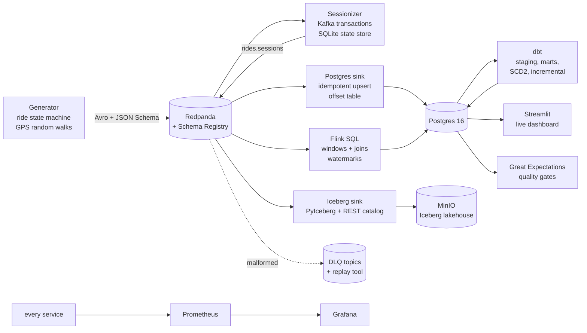

# stream-pipeline

A real-time data platform built end to end: synthetic event producers stream into Redpanda, a
transactional stream processor with exactly-once semantics sessionizes rides, Flink SQL handles
windowed aggregation, and the results land in both a Postgres serving layer and an Apache Iceberg
lakehouse on MinIO. dbt models the warehouse, Great Expectations gates data quality, and
Prometheus plus Grafana watch the whole thing, with a live Streamlit dashboard on top.

The domain is a ride-hailing operations stream: ride lifecycle events, high-volume driver GPS
pings, and payment transactions that deliberately arrive late, because real payment systems do.

> **Status: under active construction.** This README grows with the build. The progress table
> below reflects exactly what exists and is verified right now; nothing is listed as done before
> its tests have run green.

## Why this project exists

Most streaming demos cheat in one of three ways: the data is too clean, "exactly-once" is claimed
but never proven, and failure paths (late data, malformed payloads, schema drift) are simply not
generated. This project does the opposite:

- The generator produces **deliberately imperfect data**: duplicates, out-of-order events, late
  events, malformed payloads, and a mid-stream schema evolution, each at a documented, configurable
  rate.
- Exactly-once delivery is **proven by a chaos test** that SIGKILLs the processor mid-batch,
  restarts it, and asserts that Postgres holds exactly the acked event set: no duplicates, no loss.
- Every operational concern a real platform has (dead-letter queues, replay tooling, consumer lag
  alerting, quality gates that can fail the pipeline) is implemented, not mentioned.

## Architecture



## Stack

| Layer | Technology | Why |
|---|---|---|
| Event log | Redpanda (Kafka API) + built-in Schema Registry | Single binary, sub-second startup, no ZooKeeper; the Kafka transactional API works unchanged |
| Serialisation | Avro (rides, locations) and JSON Schema (payments) | Demonstrates both registry-backed formats and cross-format consumers |
| Stream processing | Hand-rolled transactional consumers (`confluent-kafka`) + Flink SQL | Shows both the code-level exactly-once mechanics and the declarative windowed path |
| Serving store | Postgres 16 | Marts, dashboard queries, offset bookkeeping for the idempotent sink |
| Lakehouse | Apache Iceberg on MinIO via PyIceberg + REST catalog | Partitioned raw history, compaction, schema evolution, time travel |
| Modelling | dbt-postgres (medallion: staging, intermediate, marts) | Incremental fact with late-data lookback, SCD Type 2 snapshot |
| Data quality | Great Expectations | Suites run as pipeline steps, results land in a queryable `dq_results` table |
| Observability | Prometheus + Grafana | Consumer lag, throughput, DLQ rate, transaction aborts, provisioned dashboards, lag alerting |
| Dashboard | Streamlit + pydeck | Live driver map, per-city ride metrics, DQ status strip |
| Tooling | Python 3.12, uv, ruff, mypy --strict, pytest + hypothesis | Full type hints, 80 percent coverage floor, property-based state-machine tests |

## Build progress

| # | Milestone | Status |
|---|---|---|
| 1 | Scaffold, tooling, CI | done |
| 2 | Avro and JSON schemas + registry setup | pending |
| 3 | Generator: coherent ride state machine | pending |
| 4 | Generator: geospatial driver movement, diurnal load | pending |
| 5 | Generator: configurable imperfections, schema evolution | pending |
| 6 | Infra: Redpanda, Console, Postgres, MinIO in compose | pending |
| 7 | Sessionizer with local state store | pending |
| 8 | Kafka transactions for exactly-once | pending |
| 9 | Idempotent Postgres sink with offset table | pending |
| 10 | DLQ envelope and replay script | pending |
| 11 to 15 | Flink jobs, Iceberg sink, compaction | pending |
| 16 to 23 | dbt models, quality gates, observability, dashboard | pending |
| 24 to 28 | Integration tests, CI e2e, docs, final README | pending |

## Repository layout

```
src/
  common/        shared config, structured JSON logging, serde helpers
  generator/     synthetic ride-hailing event producer (state machine, GPS, imperfections)
  processors/    transactional sessionizer and the idempotent Postgres sink
  sinks/         Iceberg lakehouse writer
  dlq/           dead-letter envelope construction
  quality/       Great Expectations suite runners
flink/           Flink SQL jobs, custom image with JDBC connector
dbt/             dbt project (staging, intermediate, marts, snapshots, tests)
scripts/         operational tooling: DLQ replay, Iceberg compaction, e2e harness
ui/              Streamlit live dashboard
prometheus/      scrape config and alerting rules
grafana/         provisioned dashboards (pipeline health, business metrics)
docs/            BUILD_SPEC, architecture notes, runbook, ADRs, lakehouse walkthrough
tests/           unit and integration suites (exactly-once kill test lives here)
```

## Development

Requirements: [uv](https://docs.astral.sh/uv/), Docker with roughly 10 to 12 GB available for the
full profile (about 6 GB for the core profile), GNU Make.

```bash
uv sync            # create the venv from the committed lockfile
make lint          # ruff + ruff format check + mypy --strict
make unit          # unit tests with the 80 percent coverage floor
make test          # lint + unit
```

The compose stack, seed target, and e2e harness arrive with their milestones and will be
documented here the moment they exist.

## Standing rules

The build follows the non-negotiable rules in [CLAUDE.md](CLAUDE.md): no stubs or TODOs in `src/`,
versions come only from the resolver, nothing is called done until its command has run with real
output, every number in this README traces to a committed artifact, and spec deviations are logged
in [DEVIATIONS.md](DEVIATIONS.md). The full specification is
[docs/BUILD_SPEC.md](docs/BUILD_SPEC.md).
